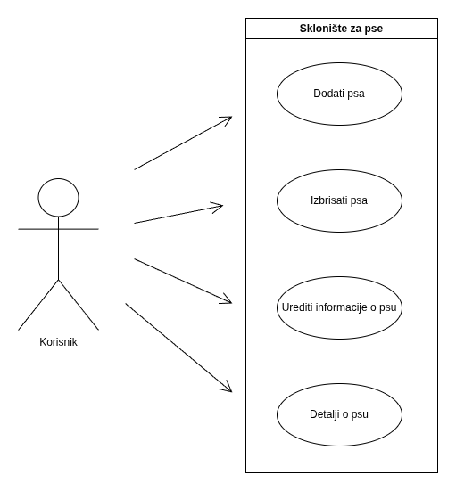

# Sklonište za pse

Projekt se fokusira na potrebu skloništa za pse za jednostavnim vođenjem evidencije pasa, njihovih osnovnih podataka i statusa udomljenja.

## Opis

Aplikacija omogućuje unos osnovnih podataka za svakog psa, kao što su ime, pasmina, spol, starost, datum prijema, status udomljenja i opis.
Backend je izrađen u Pythonu pomoću Flask okvira, dok se za bazu podataka koristi SQLite zajedno s PonyORM-om. Frontend koristi HTML i CSS kako bi se omogućilo jednostavno korištenje aplikacije kroz web preglednik.

## UseCase dijagram



## Kako pokrenuti aplikaciju

### Pomoću Docker-a

Instalirajte Docker – osigurajte da imate instaliran Docker na svom računalu.

Klonirajte repozitorij:

```bash
git clone https://github.com/jakov-subotic-fipu/skloniste_za_pse.git
cd skloniste_za_pse
```

Izgradite Docker image:

```bash
docker build -t skloniste-za-pse .
```

Pokrenite aplikaciju:

```bash
docker run -p 8080:8080 skloniste-za-pse
```

Otvorite preglednik:

Aplikacija će biti dostupna na http://127.0.0.1:8080.


